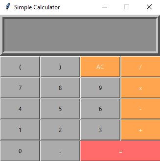

# BigData_HW_1

This file contains code of using GUI to create a simple calculator like the picture shown below

## Instruction

After download the file, simply click the file and run

By clicking the number and sign, user can get the result number after click '=' 

## Meta

Yuge Ma yma156@fordham.edu
